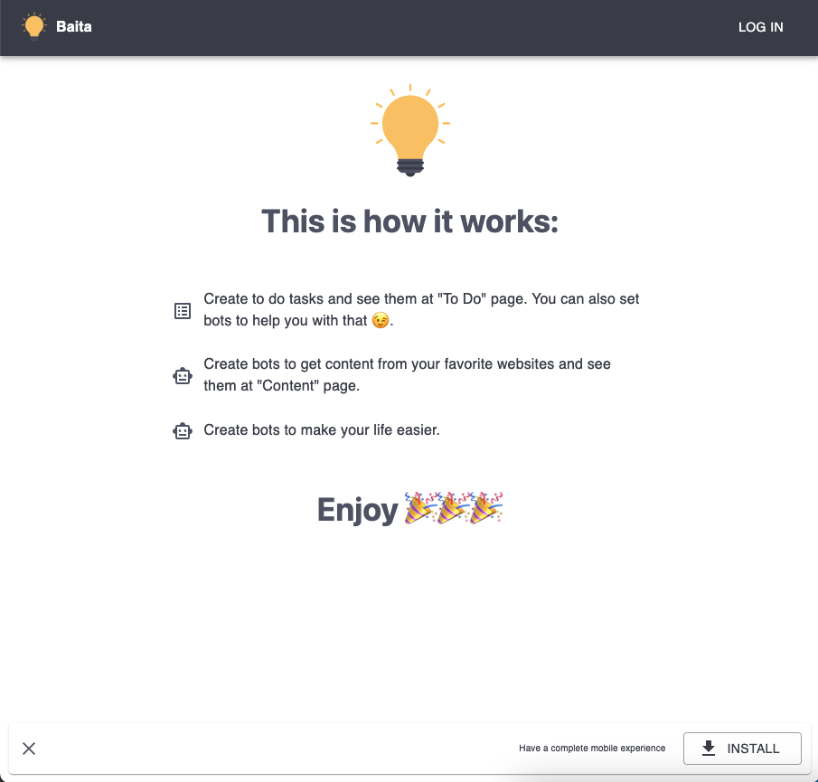
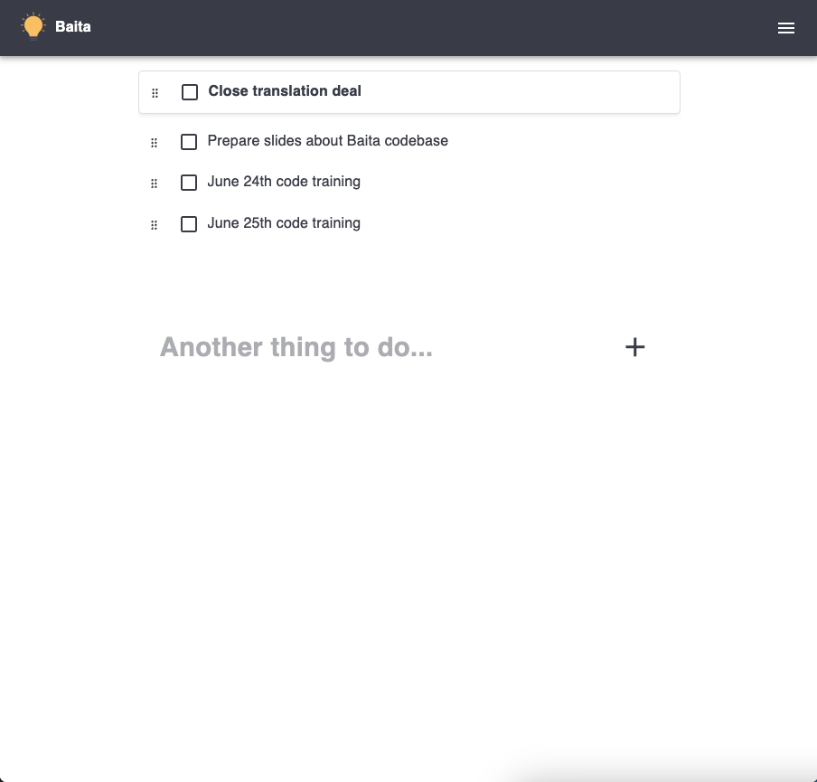
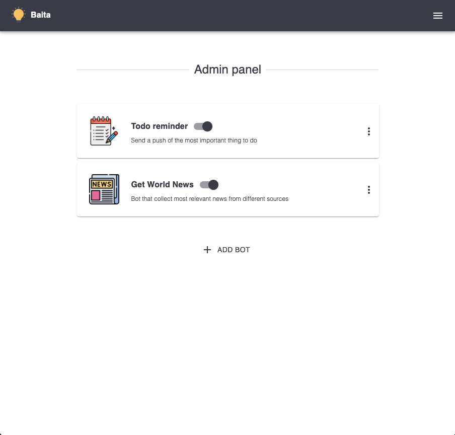
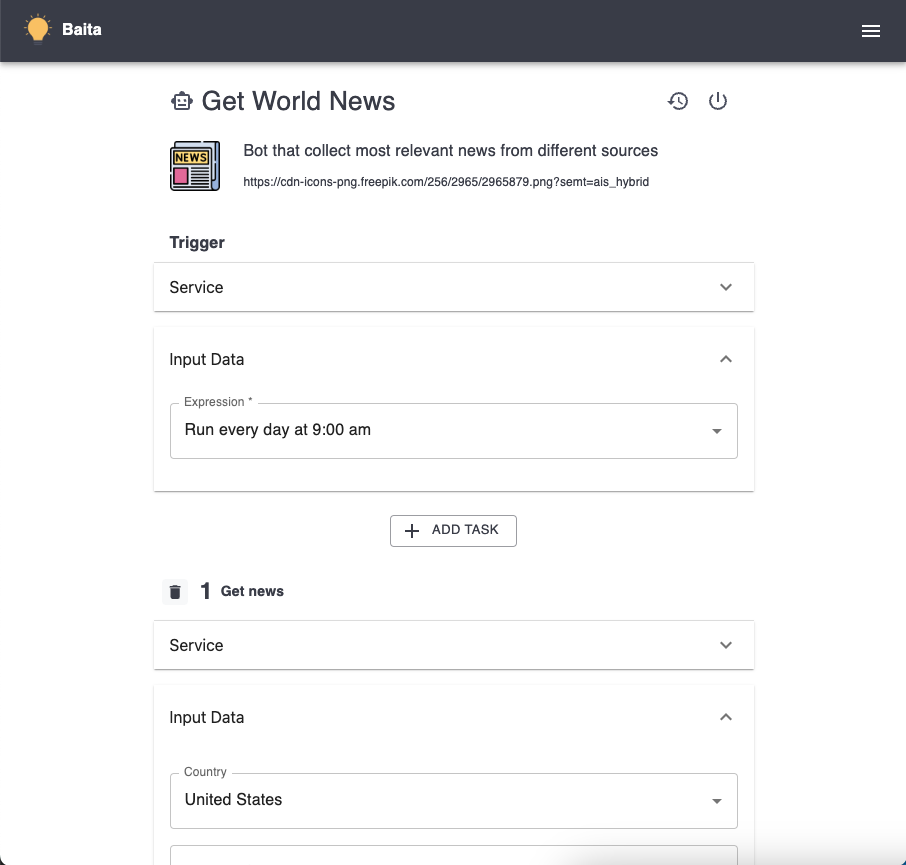
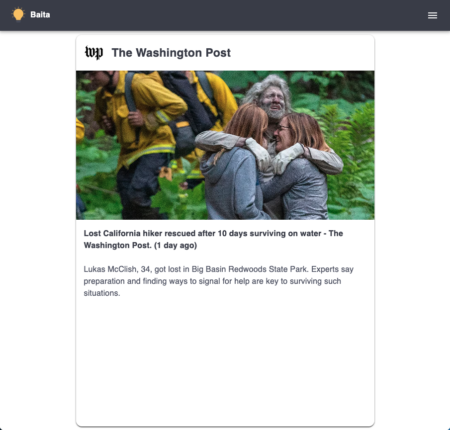
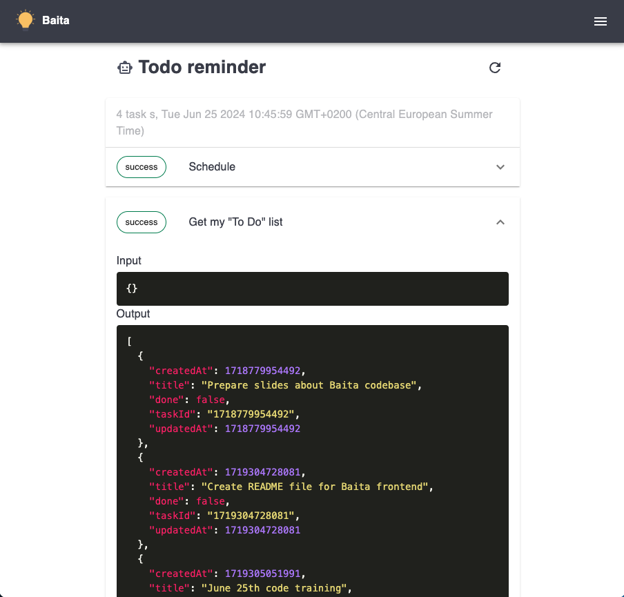

# Baita Frontend

React SPA for the Baita personal automation platform. Users build bots, manage connections, view content feeds, and organize their tasks — all from a mobile-first PWA.

**Live at**: https://baita.help

---

## Architecture

```
┌─────────────────────────────────────────────────────────────────────────────┐
│                          React Application                                  │
│                                                                             │
│  ┌───────────────────────────────────────────────────────────────────────┐  │
│  │  Router (src/router.tsx)                                              │  │
│  │  Route definitions + protected routes (withAuthenticationRequired)    │  │
│  └─────────────────────────────────┬─────────────────────────────────────┘  │
│                                    │                                        │
│  ┌─────────────────────────────────▼─────────────────────────────────────┐  │
│  │  Views (src/views/)                                                   │  │
│  │  Page-level components: todo, bots, feed, feelings, place, profile       │  │
│  │  Each view: index.tsx entry + components/ subfolder                   │  │
│  └─────────────────────────────────┬─────────────────────────────────────┘  │
│                                    │                                        │
│  ┌──────────────────────┐  ┌───────▼─────────────────────────────────────┐  │
│  │  Providers           │  │  Hooks (TanStack Query v5)                  │  │
│  │  (React Context)     │  │  Data fetching, caching, mutations          │  │
│  │                      │  │  useQuery / useMutation                     │  │
│  │  Auth → Error →      │  │  Optimistic updates, dedup, retry           │  │
│  │  Notification →      │  └───────┬─────────────────────────────────────┘  │
│  │  User → Apps → Bot   │          │                                        │
│  └──────────────────────┘  ┌───────▼─────────────────────────────────────┐  │
│                            │  API Layer (src/api/)                       │  │
│                            │  Axios singleton + Bearer token interceptor │  │
│                            │  queries.ts + mutations.ts                  │  │
│                            └─────────────────────────────────────────────┘  │
└─────────────────────────────────────────────────────────────────────────────┘
                                     │
                                     │ HTTPS (JWT)
                                     ▼
                          https://api.baita.help
```

---

## Tech Stack

- **Framework**: React 18 + TypeScript 6 (strict mode)
- **Build**: Vite 8 + @vitejs/plugin-react
- **Routing**: React Router v6
- **State**: React Context API
- **UI**: MUI Material v5, SCSS, Bootstrap 5 utilities (CDN)
- **HTTP**: Axios (wrapped in custom hook)
- **Auth**: Auth0 (@auth0/auth0-react)
- **Push Notifications**: Web Push API (VAPID-based, works on all platforms including iOS PWA)
- **Analytics**: Firebase Analytics (production only)
- **PWA**: vite-plugin-pwa (Workbox-based service worker)
- **Drag & Drop**: @dnd-kit
- **Maps**: @vis.gl/react-google-maps
- **Testing**: Vitest + React Testing Library + MSW
- **Linting**: ESLint + Prettier + CSpell
- **CI/CD**: AWS Amplify (auto-deploy on push to `main`)

## Features

- Progressive Web App (installable on desktop, Android, iOS)
- Multi-language with automatic detection (en-US, pt-BR)
- OAuth login via Auth0 (Google, email/password)
- Visual bot builder (drag & drop workflow editor)
- AI Assistant for natural language bot creation (Chrome Built-in AI)
- Push notifications (VAPID-based, cross-platform including iOS PWA)
- Content feed with auto-expiring items (DynamoDB TTL)
- Todo list management
- Feelings journal with mood tracking
- Places/maps integration
- Centralized error handling (react-error-boundary)
- Local mock server for offline development (Vite plugin)

## Getting Started

```bash
# Install dependencies (from monorepo root)
pnpm install

# Start dev server (localhost:3000)
npm start

# Run tests
npm run test:run

# Production build
npm run build

# Preview production build
npm run preview

# Code quality
npm run lint       # ESLint with auto-fix
npm run format     # Prettier formatting
npm run spell      # CSpell spell check
npm run knip       # Dead code detection
```

## Project Structure

```
src/
├── api/           # API client, queries, and mutations
├── assets/        # SCSS styles + images
├── components/    # Shared reusable UI components
├── hooks/         # TanStack Query hooks (data fetching + mutations)
├── providers/     # React Context providers (auth, error, notification)
├── utils/         # Helpers (API client, AI service, firebase, config, push, dates)
├── views/         # Page-level components (each feature has index.tsx + components/)
├── test/          # Test utilities (renderWithProviders, MSW setup)
├── app.tsx        # Theme + provider composition
├── router.tsx     # Route definitions + LINKS constants
├── navBar.tsx     # Navigation bar
├── sw.ts          # Service worker (Workbox precaching + push handling)
└── index.tsx      # Entry point (Auth0Provider wrapping)
```

## Pages

| Route               | Page     | Description                                     |
| ------------------- | -------- | ----------------------------------------------- |
| `/`                 | Landing  | Welcome page for unauthenticated users          |
| `/todo`             | Todo     | Task management (default page after login)      |
| `/feed`             | Feed     | Content feed from bot executions                |
| `/bots`             | Bots     | List and manage automation bots                 |
| `/bots/:botId`      | Bot      | Visual builder + AI Assistant for editing a bot |
| `/bots/:botId/logs` | Logs     | Bot execution history and logs                  |
| `/feelings`         | Feelings | Emotional journal with mood and dream capture   |
| `/place`            | Places   | Location-based features (Google Maps)           |
| `/profile`          | Profile  | User info and daily progress                    |

## Environment

- **Production**: `www.baita.help` → API at `https://api.baita.help`
- **Local dev**: `localhost:3000` → API at `http://localhost:5000/dev`
- **Config**: Auto-detected from `window.location.hostname` (no `.env` file)
- **Language**: Auto-detected from `navigator.language`

## Architecture Decisions

- **Auth0** — Simpler multi-provider OAuth than Firebase Auth
- **Context API** — Simpler than Redux for current scale (providers: Auth → Error → Notification → User → Apps → Bot)
- **No `.env` file** — Environment auto-detected from hostname
- **Vite** — Faster dev/build than CRA, actively maintained
- **Web Push API (VAPID)** — Works cross-platform without Firebase Cloud Messaging dependency
- **@baita/shared** — All domain models defined once with Zod, imported by both frontend and backend

## Screenshots








